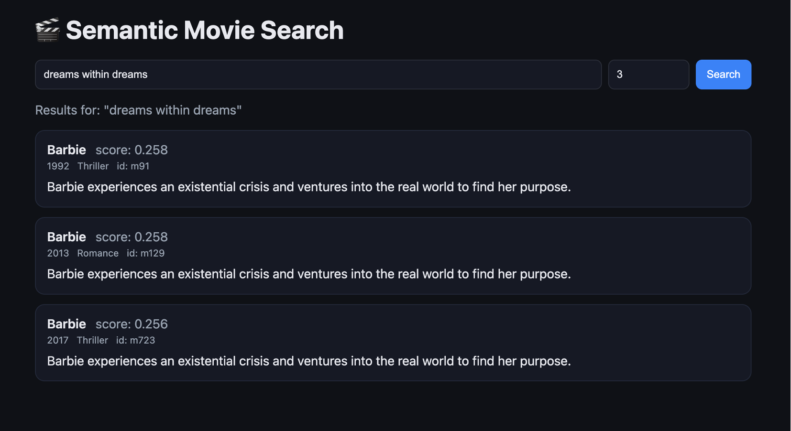
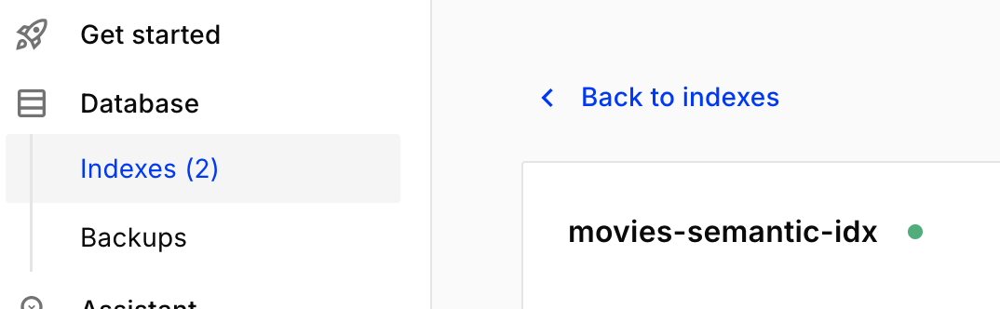
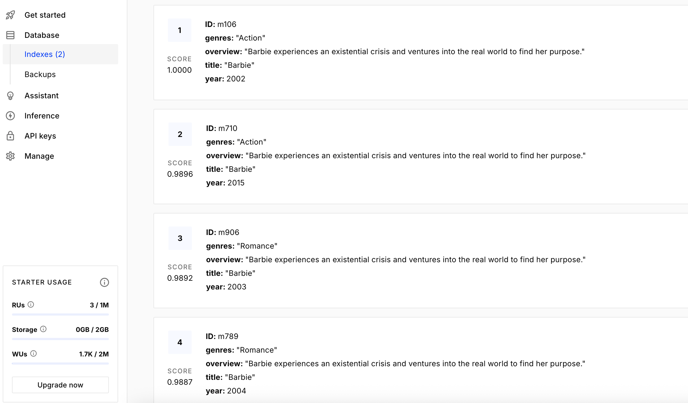

# Semantic Movie Search (Pinecone + SentenceTransformers) 

A minimal end-to-end **semantic search** app using **Pinecone serverless** and **all-MiniLM-L6-v2** embeddings.

🚀 Semantic Movie Search using FastAPI, Sentence Transformers, and Pinecone Vector DB

## Features
- Serverless Pinecone index (cosine, 384-dim)
- Local, free embeddings (no paid API)
- Clean ingest + query pipeline
- FastAPI endpoint for demos
- Small unit test

## Quickstart
```bash
python -m venv .venv && source .venv/bin/activate
pip install -r requirements.txt
cp .env.example .env  # add your Pinecone key + region
python -m src.create_index
python -m src.ingest
python -m src.query "jazz love story in Los Angeles"
uvicorn src.webapp:app --reload --port 8000
```


## Screenshot
# Web app


# Pinecone 


